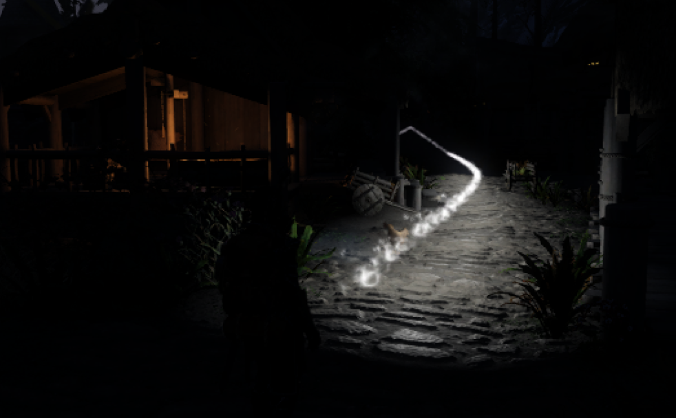

# Active Quest Trail

A persistent, animated quest trail for Skyrim Special Edition. Follow a floating trail to the active objective without equipping a spell or shout. The route's quest-marked door or object glows even when the trail stops short, and optional Community Shaders lighting illuminates nearby surfaces.



## Requirements

| Skyrim version | SKSE | Address Library |
| --- | --- | --- |
| 1.5.97 | 2.0.20 | Special Edition database: `version-1-5-97-0.bin` |
| 1.6.317, 1.6.318, 1.6.323, 1.6.342, 1.6.353, 1.6.629, 1.6.640, 1.6.1130 | Matching archived build | Anniversary Edition database matching the game version |
| 1.6.659 (GOG) | Matching archived GOG build | Matching 1.6.659 database |
| 1.6.1170 | 2.2.6 | Matching 1.6.1170 database |
| 1.6.1179 (GOG) | 2.2.6 GOG | Matching 1.6.1179 database |
| 1.7.99 | Matching archived build | All in One v13 or newer, including the 1.7.99 database |
| 1.7.104 | 2.3.1 | All in One v13 or newer, including the 1.7.104 database |

Install [SKSE](https://skse.silverlock.org/), [Address Library](https://www.nexusmods.com/skyrimspecialedition/mods/32444), and the Windows x64 Visual C++ runtime. One DLL handles all listed Steam and GOG runtimes automatically using CommonLibSSE-NG. Install the SKSE build and Address Library database matching your exact game version; older SKSE builds are available from the archive linked on the SKSE website. VR, Epic, and Windows Store/Game Pass are unsupported. Future game updates need a compatibility review before being added.

[SKSE Menu Framework 3](https://github.com/QTR-Modding/SKSE-Menu-Framework-3-API) provides the optional settings menu. Trail lighting requires Community Shaders with Light Limit Fix enabled.

## Installation

1. Install the release ZIP with your mod manager, or extract its contents into Skyrim's `Data` directory. No FOMOD or version selection is needed.
2. Enable `ActiveQuestTrail.esp`, restart Skyrim, and launch through SKSE.
3. Track a quest with an objective marker. Tracking one quest at a time gives more predictable guidance.

When updating, replace the previous mod installation and disable any old standalone trail-lighting addon. Keep only one Active Quest Trail DLL enabled. Existing saved preferences are retained.

Lighting is enabled by default. Without Community Shaders, the trail remains visible but does not illuminate nearby surfaces. You can disable lighting in the settings menu.

## Settings

Open **SKSE Menu Framework → Active Quest Trail → Settings**. Changes apply when gameplay resumes and save automatically after editing. **Save now**, **Reload settings**, **Restore defaults**, and **Rebuild trail** are also available.

Settings are written to `Data/SKSE/Plugins/ActiveQuestTrail.ini`. No settings INIs are bundled. Mod managers may redirect this file to their Overwrite folder.

| Setting | Default |
| --- | --- |
| Hold to show / press to show temporarily | Off / Off |
| Toggle / hold / timed keybind | Unbound / Unbound / Unbound |
| Timed show duration | 10 seconds (adjustable from 1 to 120) |
| Hide indoors / in dungeons / in combat | Off |
| Colour / brightness / opacity | White / 1 / 1 |
| Height above route | 20 units |
| Clear space around player | 64 units, plus particle and movement clearance |
| Destination glow / animation / sparks | On |
| Flow speed / update fade | 1 / 0.5 seconds |
| Trail lighting / brightness / radius | On / 2 / 280 units |
| Maximum trail length | 6,000 units |
| Anchor trail to route | On |
| Rebuild when off route / extend near end | 256 / 2,000 units |

**Restore defaults** resets all settings, including enabling lighting. For moving objectives, use **Rebuild trail** or disable anchoring.

Enable **Hold to show the trail** to display it only while your hold key is pressed, or **Press to show the trail temporarily** to display it for the configured duration after a key press. Enabling either mode turns the other off. Both modes are off by default, preserving the continuous trail, and both keys start unassigned. Click **Unbound** to choose a keyboard key, optionally select Ctrl, Shift, or Alt, and use **Clear** to remove it. Choose a different binding from the toggle key.

Pressing the timed key again restarts the countdown. Paused menus pause the timer, and loading a game clears it. **Enable quest trail** remains the master switch, and the indoor, dungeon, and combat visibility settings still apply to both modes.

## Translations

The menu reads Skyrim/SKSE translation tables using the game's `sLanguage` setting in `Skyrim.ini`. Missing or invalid entries fall back to English built into the DLL. Translations load at startup; restart Skyrim after installing or editing one.

To create a translation:

1. Copy [Interface/Translations/ActiveQuestTrail_ENGLISH.txt](Interface/Translations/ActiveQuestTrail_ENGLISH.txt) and rename `ENGLISH` to the game's language name, such as `GERMAN` or `FRENCH`.
2. Translate the text after each tab. Keep the `$AQT_...` keys and the single tab separating each key from its value.
3. Save as **UTF-16 little-endian with BOM**, preserving Windows (CRLF) line endings. Keep each entry on one line, avoid blank lines, and keep each complete line below 500 UTF-16 code units for the SKSE reader.
4. Keep `{0}` and `{1}` placeholders intact; they may be reordered. Keep the `%.0f`, `%.1f`, and `%.2f` conversions in the three numeric format entries unchanged. Use `%%` for a literal percent sign in those entries.
5. Install the file under `Data/Interface/Translations/` and restart Skyrim. A translation download only needs to contain `Interface/Translations/ActiveQuestTrail_<LANGUAGE>.txt`.

Do not add `##` or `###` to translations; the plugin supplies stable control IDs. The `ModName` and `Settings` values must not contain `/`, which the framework uses to separate menu sections. Invalid labels and numeric formats use their English defaults. Diagnostic log messages remain in English.

Chinese, Japanese, Korean, Cyrillic, Thai, and other character sets need a suitable font and glyph settings in SKSE Menu Framework. Configure these in the framework's settings or its `SKSEMenuFramework.ini`; AQT uses the framework's font. The English template covers AQT's controls, help, keybinding prompts, units, and trail status messages. Controls supplied by ImGui itself use the framework's text.

## Building

Use Python 3.12+, CMake 3.25+, Ninja, and a C++23 compiler targeting the Windows MSVC ABI. Dependency revisions are specified in `scripts/bootstrap.py`.

On Linux, install LLVM 20 (including clang-cl, lld-link, llvm-lib, llvm-rc, and llvm-mt). The bootstrap command downloads the Windows SDK and MSVC libraries through xwin and accepts Microsoft's SDK license:

```sh
python3 scripts/bootstrap.py --linux-sdk
cmake --preset linux
cmake --build --preset linux
python3 scripts/package.py build/linux/ActiveQuestTrail.dll
```

On Windows, run these commands from an x64 Visual Studio developer terminal with MSVC 14.51 (compiler 19.51), the Windows SDK, and Ninja available. This matches the pinned CommonLib prebuilt toolset:

```powershell
python scripts/bootstrap.py
cmake --preset windows
cmake --build --preset windows
python scripts/package.py build/windows/ActiveQuestTrail.dll
```

The build produces one DLL for all supported runtimes. Packaging generates a ZIP in `dist/` with the DLL, ESP, BSA, and translations directly under their `Data` paths. No Creation Kit, NifSkope, Skyrim installation, or extracted game assets are needed to build the package. The mist references Skyrim's existing `MagicCaustic01.dds` texture.

`VERSION` is the release version source for CMake, plugin metadata, startup logging, and packaging. For a loose developer install on any supported runtime, first run `scripts/build_assets.py` and `scripts/build_records.py`, then use `cmake --install build/linux --prefix <Data-directory>` (or `build/windows`).

## Source layout

- `src/`: route handling, rendering, destination glow, settings, and plugin entry point.
- `scripts/`: dependency bootstrap and asset/package generation.
- `cmake/`: cross-compilation toolchain and generated version header template.
- `docs/`: mod screenshots.
- `Interface/Translations/`: menu translation files and the English template.
- `extern/` and `licenses/`: vendored menu API and third-party license notices.

Build caches, generated assets, release archives, and local settings are ignored by Git. The invisible guide mesh still references `wisp.dds`; both are generated and required.

## License

GPL-3.0-or-later with the additional permissions in [EXCEPTIONS.md](EXCEPTIONS.md). See [LICENSE](LICENSE) and [THIRD_PARTY.md](THIRD_PARTY.md) for dependency sources and notices. Keep those files with the published source. The mod installer contains runtime files only.
